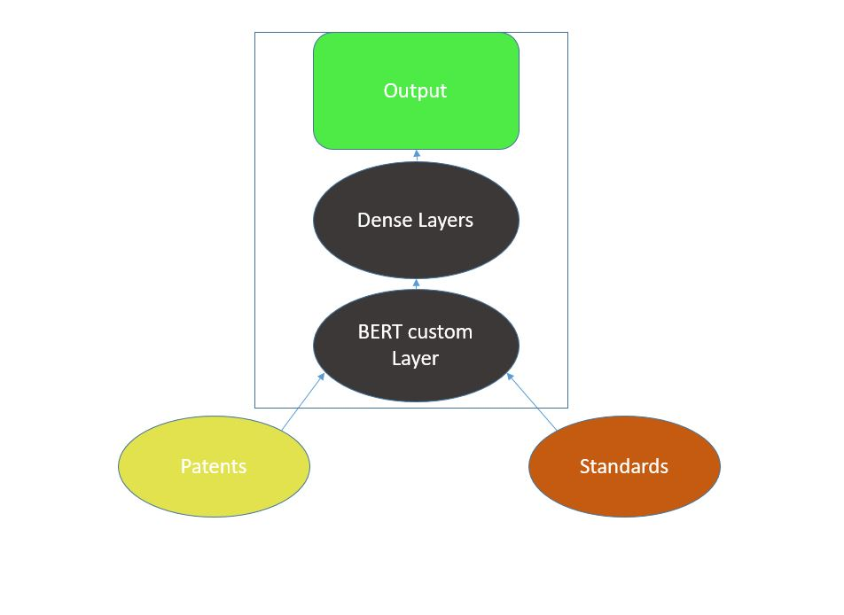

# Patent_NLP
This is a work repository. Specifically for documenting the daily thesis work. 

#######################################################################################

# How was the data downloaded? 
The data was downloaded from 
1) [ IPR ETSI](https://ipr.etsi.org/DynamicReporting.aspx)
   Provides the csv file where the patents and standard mappings are found.
   We need to do some EDA to obtain the data required for download.

2) [USPTO](https://ppubs.uspto.gov/pubwebapp/) and [Google Patents](https://patents.google.com/)

Webscraping and webautomation using selenium was used. These scripts can be found in webautomation directory. 

What are the advancements made so far in this area? 

The project aims to develop advanced Natural Language Processing techniques for analyzing and processing patent documents, improving efficiency in patent search, classification, and information extraction.
Key Techniques Used:

Text Extraction and Preprocessing:

Optical Character Recognition (OCR) for scanned patent documents
PDF parsing for digital documents
Text cleaning and normalization techniques

# Information Extraction:

Regular expressions for structured data extraction (e.g., patent numbers, dates)
Rule-based systems for domain-specific entity extraction
Conditional Random Fields (CRF) for sequence labeling tasks

# Advanced NLP Models:

While BERT and other transformer models are powerful:

Domain-specific word embeddings trained on patent corpora
Long Short-Term Memory (LSTM) networks for sequential data processing
Attention mechanisms for focusing on relevant parts of patent text

# What are the models used here? 

## BERT

### CustomLayers: 
BertModelLayer: Wraps a BERT model for use in the Keras framework. 
ReshapeLayer: Reshapes input tensors
Attentionlayers: Implements an attention mechanism. 
Crossattenstion: Implements cross-attention between two sequences. 
ResidualBlock: Creates a residual connection in the network. 

### Model architecture
1) Inputs: Separate input layers for patent and standard documents, including input IDs and attention masks.
2) BERT Embeddings: Both patent and standard inputs are passed though BERT models to get embeddings.
3) Cross-attention: Applied between patent and standard embeddings to cature relationships.
4) Pooling : Uses max pooling, average pooling, and attention-based pooling on the combined embeddings.
5) Dense Layers: Multiple dense layers with residual connections and dropout for further processing.
6) Ouput: A single sigmoid output, suggesting a binray classification task.

### Model Creation
The create_model function sets up this architecture using the custom layers and Keras functional API. 

### Optimizations
1) Uses Adam optimizer with a learning rate schedule(Exponential Decay).
2) Copiled with binary crossentropy and accuracy metric.

I know what you are thinking? How could we capture the relationships between words when we have divided them into chunks of text. THe semantic meaning would be different when we do this part. 
In order to solve this probelm why don't we chunk by sentences instead of manual chunking of text. When looking at this what we found is paecter. 

## Paecter( basically a sentence transformer trained on patent corpus)

Work is ongoing. 

What are the advantages ? 

THe advantage is that no need of manual chunking. 

# Challenges:

Domain Complexity: Patents often contain highly technical and specialized language, making general-purpose NLP models less effective.

Document Structure: Patents have a unique structure that can be challenging to parse and extract information from consistently.

Data Quality: Dealing with OCR errors, inconsistent formatting, and historical documents can affect the quality of extracted information.

Scalability: Processing large volumes of patent data efficiently while maintaining accuracy.

Multilingual Processing: Patents are filed in multiple languages, requiring robust multilingual NLP capabilities.

Legal Implications: Ensuring the accuracy of extracted information is crucial due to the legal nature of patents.

Temporal Dynamics: Patent language and technology evolve over time, requiring models that can adapt to these changes.

Handling of Images and Diagrams: Extracting and interpreting information from non-textual elements in patents.

